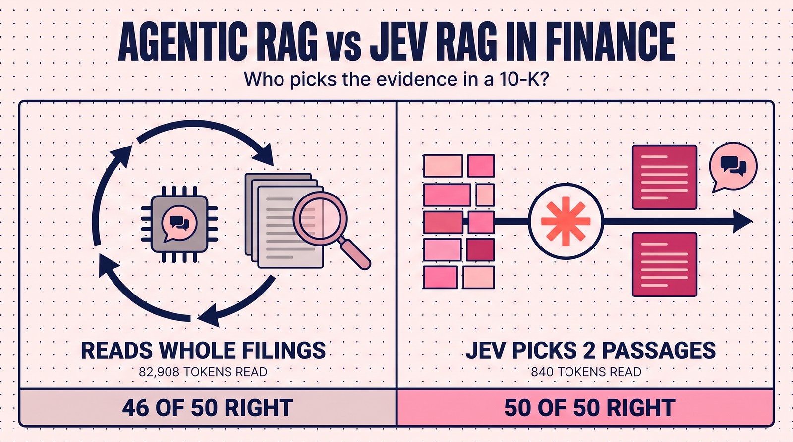
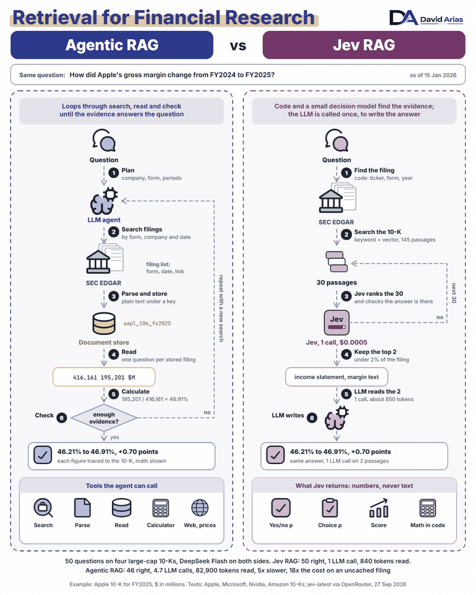
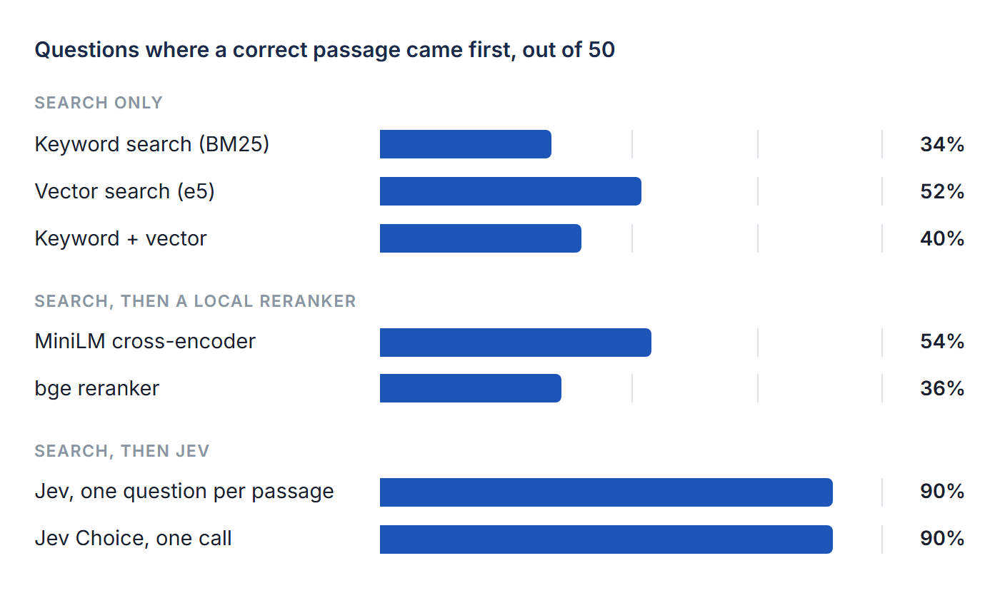

# Is Jev efficient for RAG? A test on 10-Ks from Apple, Microsoft, Nvidia and Amazon

*A decision model that only returns numbers found the evidence for all 50 analyst questions, with one LLM call per answer and about 100 times fewer tokens than an agentic pipeline.*

David Arias, CFA · 27 September 2026 · also on [davidariasfinance.com](https://davidariasfinance.com/research/is-jev-efficient-for-rag/)



An AI agent that opens last year's 10-K will quote last year's numbers with full confidence. In the test below it happened four times in 50 questions, even with today's date in its prompt, while its LLM read about 83,000 tokens per question to get there.

Jev, a small decision model released in September, could be a better tool for that step of financial research. A test on the annual reports of Apple, Microsoft, Nvidia and Amazon is a good sign: a pipeline built around Jev answered all 50 questions correctly, with one LLM call per answer, and it held when the LLM was swapped for Qwen 3.7 Flash or GPT-5 nano.

## What Jev is, and why it caught on

TypeSafe released Jev on 15 September 2026. It reads text like a language model and never writes any. You ask it a yes or no question (a *Noul*), a multiple choice question (a *Choice*, up to 255 options) or a graded one (a *Score*), and it answers with probabilities. Input costs $0.042 per million tokens, and output is free because there isn't any.

That design fits a real gap in agent systems. Most steps inside an agent are decisions: is this passage relevant, which tool comes next, is this answer supported. Asking a chatty model for a decision means parsing its prose and hoping it phrases things the same way twice. A model that returns 0.97 hands the decision to code, where the threshold is explicit and testable.

Developers noticed fast. Within ten days there were arXiv papers testing Jev on legal contracts ([Zhang et al.](https://arxiv.org/abs/2609.27678)) and as a judge of other models ([Li et al.](https://arxiv.org/abs/2609.26550)), plus dozens of independent benchmarks on GitHub. Finance barely shows up. No paper had tested Jev on company filings, and no public test found for this article compared it with agentic RAG, the setup most finance agents use today.

TypeSafe's own sign-ups are closed, so every Jev call in this test runs through OpenRouter, which exposes the same API at its systemone endpoint and bills it to OpenRouter credit. One call ranking 30 passages of a 10-K, about 12,000 tokens, took a median of 0.5 seconds and cost about $0.0005.

## Why Jev fits the retrieval step

Retrieval in RAG is a decision: of the passages search found, which one states the answer? That's the kind of question Jev was built for.

It reads the question and each passage together. Vector search compares two embeddings made separately, which is why it stumbles when an analyst asks for the "bottom line" and the filing says "net income".

It's cheap enough to read everything search returns, and its answer can't drift: a Choice returns one of the passage IDs it was given, never an invented one, with no prose to parse.

It also says when to widen the search. A yes or no on "is the answer in these passages?" gives code a clean signal to pull more candidates. And the LLM reads less, two passages instead of whole filings.

## Two ways to answer a question from a filing



*Agentic RAG and Jev RAG on the same question. Every figure in the footer comes from the tests below.*

Agentic RAG follows the design of the [Vals AI Finance Agent](https://github.com/vals-ai/finance-agent-v2) harness, an open benchmark for finance agents. An LLM agent (DeepSeek Flash) plans which company, form and year it needs, searches SEC EDGAR, asks a second DeepSeek Flash call to read the whole filing with a focused question, uses a calculator for any arithmetic and loops until the evidence satisfies it.

Jev RAG follows TypeSafe's [reranking pattern](https://docs.typesafe.ai/cookbooks/rerank_typesafe). Code looks up the latest filing, because ticker, form and fiscal year are simple lookups. Keyword and vector search cut the 10-K down to 30 candidate passages. One Jev call ranks them and asks whether the answer is there at all. An LLM appears once, at the end, to read the top two passages and write the answer: DeepSeek Flash, or Qwen 3.5 4B running locally.

In code, the Jev step is a single request with two questions:

```python
# jev(): POST https://openrouter.ai/api/v1/systemone, model "jev-latest"
def ask(candidates):
    return jev(state=question_with(candidates), questions={
        "best": {
            "type": "choice",
            "instructions": "Which passage states the information "
                            "needed to answer the question?",
            "criteria": {pid: f"passage {pid}" for pid in candidates},
        },
        "exists": {
            "type": "noul",
            "instructions": "Do these passages contain the answer "
                            "to the question?",
        },
    })
```

and a few lines of code decide what the LLM gets to read:

```python
answers = ask(hybrid[:30])
if answers["exists"]["noul"] < 0.5:    # answer not in these 30
    answers = ask(hybrid[30:60])       # so try the next 30
p = answers["best"]["probabilities"]
top_two = sorted(p, key=p.get, reverse=True)[:2]  # all the LLM sees
```

## How the test was run

Four annual reports were pulled from EDGAR, converted to plain text and split into passages of 1,500 characters. Their fiscal years end in four different months, so "latest" means a different date for each company.

| Company | Filing | Fiscal year ends | Passages | Questions |
| --- | --- | --- | ---: | ---: |
| Apple | 10-K, fiscal 2025 | September | 145 | 20 |
| Microsoft | 10-K, fiscal 2026 | June | 216 | 10 |
| Nvidia | 10-K, fiscal 2026 | January | 227 | 10 |
| Amazon | 10-K, fiscal 2025 | December | 189 | 10 |

Questions were phrased the way an analyst asks them, often in words the filing never uses: "What was Microsoft's bottom line in its latest fiscal year?", "How big is Nvidia's data center business?", "Why did AWS sales grow?", "How much term debt does Apple carry?". Forty ask for a figure and ten for a reason or a list.

A passage counts as correct when it contains the exact answer, a figure or a sentence, which is a strict rule:

```python
gold = {p.id for p in passages if "35,562" in p.text}  # Microsoft R&D
correct = ranking[0] in gold
```

Final answers were checked automatically against the filings, and then every one was read by hand; the hand check overruled the automatic grade 13 times, in both directions, mostly for correct answers worded differently.

Tests ran on 27 and 28 September 2026:

1. **Retrieval only.** Seven setups on all 50 questions, scored on whether they put a correct passage first. Two costlier setups ran on Apple's 20 only.
2. **End to end.** Three complete pipelines answer every question. Both designs use DeepSeek Flash as the LLM, so the only difference between them is the design.

For every question, the agent runs this loop, with up to 3 filing reads:

```python
tools = [search_filings, read_filing, calculator]
messages = [system(AGENT_PROMPT + TODAY), user(question)]
for turn in range(8):                        # at most 8 turns
    reply = llm(messages, tools=tools)       # DeepSeek Flash picks a step
    if not reply.tool_calls:
        return reply.content                 # the final answer
    for call in reply.tool_calls:
        if call.name == "read_filing":       # whole 10-K plus one question
            result = llm([READER_PROMPT, filing(call.key), call.question])
        else:                                # EDGAR search or calculator
            result = run_tool(call)
        messages.append(tool_result(call, result))
```

Every agentic run was told today's date, with one line in its system prompt:

```python
# Apple: 17 of 20 right without this line, 20 of 20 with it
system_prompt += " Today's date is 27 September 2026."
```

A first run without it answered three of Apple's questions and the first Microsoft ones from the previous year's filing. Agent harnesses normally give the date, so the numbers below include it.

Models used, and their size:

| Role | Model | Parameters |
| --- | --- | ---: |
| Agent and filing reader (Agentic RAG) | DeepSeek Flash (DeepSeek V4 Flash), thinking on | 284B, 13B active |
| Answer writer (Jev RAG) | DeepSeek Flash, same settings | 284B, 13B active |
| Answer writer, local option | Qwen 3.5 4B through Ollama, 4-bit | 4.7B |
| Agent and answer writer, other LLMs (Result 3) | Qwen 3.7 Flash and GPT-5 nano through OpenRouter, provider defaults |   |
| Picks the passages (Jev RAG) | Jev (`jev-latest` through OpenRouter) |   |
| Vector search | `multilingual-e5-base` | 278M |
| Keyword search | BM25 | no model |
| Rerankers, retrieval test only | MiniLM-L-6 and bge-reranker-base | 22.7M and 278M |

## Result 1: finding the right passage

This part tests retrieval alone, with no LLM and no agent: every method ranks the same filing's passages, and the score is whether a passage holding the answer comes first. Agentic RAG never ranks passages, since its agent reads whole filings, so it's compared in Result 2.



*Apple, Microsoft, Nvidia and Amazon 10-Ks, 50 questions. Only passages holding the exact answer count, which undercounts Jev.*

Search alone struggles with filings, and it gets worse as they grow. Keyword and vector search combined put a correct passage first on 11 of Apple's 20 questions and on 9 of 30 for the three larger filings. Two rerankers trained on web search helped a little at best, most likely because 10-K tables arrive as flattened rows of numbers.

Jev put a correct passage first on 45 of 50, both with one question per passage and with a single Choice call over all 30 candidates, which costs about $0.0005 a question. That strict rule undercounts it. Its "misses" include Apple's balance sheet for a term debt question, Microsoft's quarterly buyback table and a passage cut off at the edge of Amazon's cash flow table, and each of those answers the question.

Twice the first search missed the right passage altogether, for Microsoft's R&D and Nvidia's headcount. Both times Jev said the answer wasn't among the 30 (p = 0.47 and 0.07), the code pulled the next 30, and the right passage made the final two.

Order matters less than feared. With the 30 candidates shuffled into two other orders, Jev's top pick changed on 14 of 50 questions, yet the count of correct top picks barely moved: 45, 46 and 44 of 50. Most changes swapped one valid passage for another.

Two setups ran on Apple alone. Jev over all 145 passages, with no search first, scored 19 of 20 at about eight times the cost of the Choice call. DeepSeek Flash, asked to rank the same 30 candidates, scored 20 of 20 at about three times the cost, after a second attempt for four empty replies.

## Result 2: the full answer

| Pipeline | Apple | Microsoft | Nvidia | Amazon | Right |
| --- | ---: | ---: | ---: | ---: | ---: |
| Agentic RAG with DeepSeek Flash | 20 | 9 | 9 | 8 | 46 of 50 |
| Jev RAG with DeepSeek Flash | 20 | 10 | 10 | 10 | 50 of 50 |
| Jev RAG with Qwen 3.5 4B (local) | 18 | 10 | 9 | 8 | 45 of 50 |

| Per question, all 50 | LLM calls | Tokens read by the LLM | Seconds | Cost |
| --- | ---: | ---: | ---: | ---: |
| Agentic RAG with DeepSeek Flash | 4.7 | 82,908 | 11.1 | $0.0031 cached, $0.0133 uncached |
| Jev RAG with DeepSeek Flash | 1 | 840 | 2.0 | $0.0007 |
| Jev RAG with Qwen 3.5 4B (local) | 1 | 990 | 12.6 | $0.0006 |

*Every LLM call in the first two rows runs on DeepSeek Flash; in the third, Qwen 3.5 4B writes the answer on a laptop GPU. Jev picks the passages in both Jev rows.*

All four agentic misses had one cause, even with the date in the prompt: the agent searched for the previous year's filing and answered for it. Microsoft's diluted EPS came back as fiscal 2025's $13.64, Nvidia's data center drivers as those of earlier years, and both of Amazon's "why" questions described 2024. It read those filings correctly; it picked the wrong one. Code that always takes the latest filing can't make that mistake, although it would need a date parser for questions about earlier years.

Cost depends on caching. DeepSeek charges $0.003 per million tokens of DeepSeek Flash input it has seen recently and $0.15 for new input. Once the agent had read a filing, repeat questions about it were cheap, and the agentic pipeline cost about four times as much as Jev RAG. On a filing it hadn't read yet, it cost about eighteen times as much. Speed and volume don't depend on caching at all: Jev RAG answered five times faster, and its LLM read about 100 times fewer tokens.

A small local model can handle the last step, with care. Qwen 3.5 4B (4.7B parameters), running on a laptop GPU, answered 45 of 50 from Jev's two passages. Its misses were reading errors: the prior year's column three times, an invented figure once, and a cause the filing doesn't give once.

## Result 3: does it hold with other LLMs?

Jev's picks don't depend on the LLM, so the same two passages went to each model. Agentic RAG ran again in full with each model as agent and filing reader: same prompt, tools, limits and date.

| LLM | Agentic RAG | Jev RAG | Agent tokens read per question | Jev RAG tokens read per question |
| --- | ---: | ---: | ---: | ---: |
| DeepSeek Flash | 46 of 50 | 50 of 50 | 82,908 | 840 |
| Qwen 3.7 Flash | 41 of 50 | 49 of 50 | 82,428 | 988 |
| GPT-5 nano | 34 of 50 | 48 of 50 | 64,634 | 815 |

Jev RAG held at 48 to 50 whichever model wrote the answer, while the agent ranged from 34 to 46. Most agent misses were the same wrong-year mistake, 21 of 29 across the three models, so it isn't a quirk of one model family. GPT-5 nano also asked a clarifying question back four times instead of searching, and Qwen 3.7 Flash ran out of turns once. Running a multi-step loop is where smaller models break; reading two good passages is easy for all of them.

Through OpenRouter the agent cost $0.0028 to $0.0038 a question with these two models. Jev RAG answers cost under $0.001, Jev included.

## Limits

Four companies, 50 questions and three LLMs are enough to show a pattern, and too few to settle it.

- All four are US large caps with clean, well-structured 10-Ks. Smaller filers and messier documents may be harder for every setup.
- The Jev pipeline takes the latest 10-K by design, which suits these questions. Questions about earlier years need a date parser, and there the agent's search has an edge.
- Jev runs in TypeSafe's cloud. For confidential documents, only the LLM step can stay on your own hardware today.
- By its vendor's own account Jev is weak with numbers and dates. Here it only judged which passage holds the answer. Every figure in the final answers came from the LLM reading the passage, and any arithmetic can stay in code.
- Larger frontier models may run the agent loop better than the budget models tested here.
- Prices are list prices on 27 September 2026 and will change.

## What comes next

Quarterly filings and questions about earlier years, where "latest" stops being the right default and choosing the filing becomes the hard part. That's where a decision model in the retrieval step has the most left to prove.

*Tests run on 27 and 28 September 2026 with jev-latest, qwen/qwen3.7-flash and openai/gpt-5-nano through OpenRouter, deepseek-flash, qwen3.5:4b through Ollama, BM25, intfloat/multilingual-e5-base and two cross-encoder rerankers. Filings from SEC EDGAR, accessions 0000320193-25-000079 (Apple), 0001193125-26-323660 (Microsoft), 0001045810-26-000021 (Nvidia) and 0001018724-26-000004 (Amazon). Agentic design after [vals-ai/finance-agent-v2](https://github.com/vals-ai/finance-agent-v2); Jev RAG after TypeSafe's [reranking cookbook](https://docs.typesafe.ai/cookbooks/rerank_typesafe). Nothing here is investment advice.*

---

Code, logs and filings for every number above: [the repository root](../README.md). Text and figures in this folder are licensed [CC BY 4.0](https://creativecommons.org/licenses/by/4.0/).
